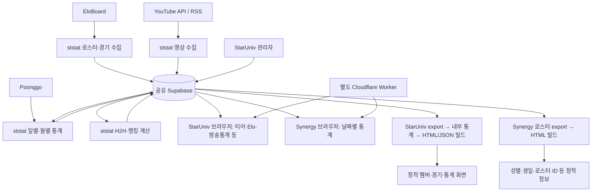

# StarUniv · ststat · Synergy 구조 분석

분석일: 2026-09-23. 로컬 체크아웃 기준: StarUniv `81fd9f0`, ststat `7cf6962`, Synergy `65bc7fa`.

> 2026-09-23 후속 작업: 이 보고서의 P1/P2 항목을 구현에 반영했다. 운영 적용 전에는
> ststat migration `008`, `009`를 순서대로 실행해야 한다.

## 종합 판단

외부 데이터 수집을 ststat로 모은 방향은 좋다. EloBoard 중복 수집을 줄였고, 수집기·계산기·저장소를 분리했으며, 관리자 소유 데이터와 자동 갱신 데이터를 구분하려는 설계가 명확하다.

다만 현재 상태는 **수집 중앙화는 상당히 완료됐지만, 데이터 공개·웹 갱신·쓰기 권한 경계는 아직 전환 중인 구조**다. 다음 작업은 코드를 더 옮기는 것보다 데이터가 잘리거나 잘못 덮어써지지 않게 만드는 것이 우선이다.

## 확인 범위와 한계

- 세 저장소의 파이프라인, 주요 브라우저 조회 경로, 관리자 저장 경로, SQL, 테스트를 분석했다.
- 문서의 배포·SQL 실행·삭제 지시는 분석 자료로만 취급했다. 실행하지 않았다.
- 운영 Supabase, 외부 cron, Cloudflare Worker 배포, GitHub 실행 기록에는 접속하지 않았다. 실제 장애 발생 여부나 운영 DB 설정은 단정하지 않는다.
- ststat 기존 테스트: `python -m pytest -q` → **19 passed**. 로컬 Python 3.14.7에서 실행했으며 Actions의 Python 3.12와는 다르다.
- 외부 연결 없는 mock/순수 함수 검증으로 부분 응답의 0 변환, 활성 스냅샷 실패 처리, 영상 숨김 기본값 덮어쓰기를 재현했다.
- 최초 분석 당시에는 코드·DB·배포를 수정하지 않았다. 이후 요청에 따라 코드와 migration을 수정했으며 운영 DB와 배포에는 아직 적용하지 않았다.

## 현재 데이터 흐름

| 영역 | 실제 담당 | 남은 경계 |
|---|---|---|
| EloBoard 수집·랭킹·H2H 산출 | ststat | 브라우저는 상세 경기 원본을 읽고 다시 필터·집계 |
| Poonggo·일별 통계·월말 확정 | ststat | 공개 테이블에 직접 나눠 쓰며 완성본 전환 없음 |
| YouTube 수집 | ststat | 관리자 소유 `hidden`도 쓰고 있음 |
| 로스터·경기·일정 수동 편집 | StarUniv 관리자 | 일부 공개 화면은 DB가 아닌 빌드 결과 사용 |
| 내부 경기 통계·내전 미러 처리 | StarUniv 빌드 | ststat의 `rounds_effective`와 로직이 병존 |
| 실시간 방송 | 별도 Worker | 세 저장소에서 Worker 구현·배포 상태 확인 불가 |

ststat는 상시 API 서버가 아니라 GitHub Actions 기반 배치 시스템이고, 두 웹의 실제 조회 API는 Supabase다. 이 구성 자체는 적절하지만, 공개용 데이터 계약과 갱신 시점을 함께 관리해야 한다.

## 우선 해결할 문제

### 1. P1 — 정리 실패가 정상 공개 중인 Elo 스냅샷을 없앰

근거: [calculate_eloboard_stats.py](../ststat/jobs/calculate_eloboard_stats.py#L33), [derived_stats.py](../ststat/repositories/derived_stats.py), [스냅샷 SQL](../ststat/migrations/004_eloboard_derived_stats.sql).

`write_snapshot → activate_snapshot → cleanup_old_snapshots`가 같은 try 안에 있다. 마지막 정리 단계에서 오류가 나면 except가 이미 활성화된 새 스냅샷을 `failed`로 바꾼다. 이전 스냅샷은 활성화 시 `retired`가 됐으므로 active가 하나도 남지 않는다. 공개 선수 뷰는 active를 조인하므로 빈 결과가 될 수 있다.

**재현:** 정리 함수만 예외를 내도록 mock했을 때 `activate_snapshot('new')` 다음 `mark_failed('new', ...)`가 호출됐다.

**개선:** 게시 전 실패 처리와 게시 후 정리를 분리한다. 정리 실패는 별도 경고·재시도 대상으로 남긴다. 실패 상태 전환도 `status='building'` 조건으로 제한한다. 정리 실패 후 active가 유지되는 회귀 테스트를 추가한다.

### 2. P1 — Synergy 일부 응답을 정상 0으로 덮어씀

근거: [sync_synergy_daily.py](../ststat/jobs/sync_synergy_daily.py#L118), [synergy_daily.py](../ststat/processors/synergy_daily.py#L18).

Poonggo 반환 수가 로스터의 50% 이상이면 쓰기를 허용한다. 빠진 사람은 `MonthlyLiveStats()`로 처리돼 별풍선·방송시간·시청자가 전부 0이 된다. 같은 날짜 기존 정상 통계도 이 값으로 upsert된다.

**재현:** 로스터 100명에 응답 50명은 수량 검사를 통과하며, 나머지 50명은 0인 행으로 생성됐다. 실제 외부 API가 미방송자를 생략하는지 여부는 별도 확인이 필요하지만, 코드가 미응답과 실제 0을 구분하지 않는 것은 확인됐다.

**개선:** 요청 ID별 응답 상태를 검증하고 `missing`과 `zero`를 구분한다. 불완전한 응답은 게시를 보류하거나 이전 유효값과 stale 표시를 유지한다. 임계치만 높이는 것으로 해결하지 말고 원천 응답 계약을 명시한다.

### 3. P1 — 일별 통계가 완성되기 전에 공개됨

근거: [upsert_daily_snapshot](../ststat/repositories/synergy_stats.py#L128), [Synergy 공개 SQL](../synergy/supabase/web_cutover.sql), [브라우저 조회](../synergy/scripts/templates/app.js.j2#L229).

`daily_member_stats`에 500행씩 직접 upsert한다. 첫 묶음만 저장돼도 날짜 목록 뷰에 새 날짜가 나타난다. 두 번째 요청에서 실패하면 일부 인원만 있는 날짜가 최신 데이터로 남는다. 같은 날짜 재실행 중에는 이전 값과 새 값이 섞인다. 로스터에서 빠진 사람의 기존 당일 행도 upsert만으로 제거되지 않는다.

**개선:** 일별 통계에도 `snapshot_id`, `building/published` 상태, 행 수·중복·완결성 검증을 도입한다. 완성된 버전만 트랜잭션으로 공개하고 날짜 목록은 published 버전에서 만든다. 이전 완성본은 재시도 중 계속 읽을 수 있어야 한다.

### 4. P1 — 로스터 페이지 처리가 경로마다 다름

근거: [ststat 로스터 읽기](../ststat/repositories/roster.py#L15), [StarUniv 티어 읽기](templates/assets/page-tier.js#L67), [수정된 Synergy 로스터 읽기](../ststat/repositories/synergy_stats.py#L12).

ststat의 기본 `load_roster`, `load_pending_ids`, StarUniv의 `fetchTierMembers`는 한 번만 select한다. 반면 Synergy 일별 수집과 H2H에는 페이지 처리가 있다. 로컬 `data/db.json`의 tierMembers와 Synergy `data/members.json`에는 각각 **1,231명**이 있다. 운영 응답 상한이 1,000행이면 이미 영향을 받을 규모다.

**영향:** 티어 명단 누락, 기존 선수를 신규 후보로 오인, 후보 수 보호 장치에 의한 파이프라인 중단 가능성이 있다. 실제 운영 상한은 확인하지 않았다.

**개선:** 전체 목록이 필요한 조회에 공통 pagination을 적용한다. `source_order, id`처럼 고유한 보조 정렬 키를 둔다. 999·1000·1001·1231행, 중복 source_order 사례를 검증한다. 날짜 목록도 장기적으로 페이지 처리가 필요하다.

### 5. P1 — 영상 수집이 관리자 숨김 값을 덮어쓸 수 있음

근거: [videos.py](../ststat/repositories/videos.py#L23), [hidden 쓰기](../ststat/repositories/videos.py#L74).

문서상 `hidden`은 관리자 소유지만, 구현은 이전 조회 결과의 hidden을 upsert payload에 포함한다. 조회 후 관리자가 숨김을 변경하면 배치가 예전 값으로 되돌릴 수 있다. 기존 영상 조회 범위 밖에 있는 영상은 `False`로 기본 처리된다. `.limit(5000)`도 실제 서버 응답 상한과 전체 보존을 보장하는 페이지 처리가 아니다.

**재현:** 기존 캐시에 없는 ID를 수집하면 쓰기 payload에 `hidden=False`가 들어갔다. 해당 ID가 DB에서 숨김 상태라면 재노출 위험이 있다.

**개선:** 전용 upsert RPC의 충돌 UPDATE 절에서 자동 소유 컬럼만 갱신한다. hidden은 신규 INSERT 기본값으로만 취급한다. 다른 소유자의 값을 읽어서 복사하는 방식 대신, 그 컬럼을 변경할 수 없도록 쓰기 경계를 제한한다.

### 6. P1 — 관리자 저장과 정적 웹 갱신의 연결이 없음

근거: [경기 저장](templates/assets/page-admin.js#L361), [정적 데이터 읽기](templates/assets/core.js#L238), [StarUniv 빌드](.github/workflows/update.yml), [Synergy 빌드](../synergy/.github/workflows/update-stats.yml), [성별·생일 정적 삽입](../synergy/scripts/generate_pages.py#L172).

관리자는 DB를 즉시 바꾸지만 StarUniv 멤버·경기·내부 통계는 빌드된 JSON/HTML을 사용한다. 두 웹 워크플로는 수동 실행 또는 특정 소스 파일 push로 실행되며, 확인한 코드에는 관리자 저장이나 ststat 완료가 웹 빌드를 호출하는 경로가 없다.

Synergy는 일별 수치를 DB에서 읽지만 성별·생일은 빌드 시 STATIC_INFO에 박힌다. 신규 인원이 STATIC_INFO에 없으면 성별을 `m`으로 처리하므로 단순 표시 지연을 넘어 성별 집계도 잘못될 수 있다.

**개선:** 단기적으로 DB 변경 후 서버 측에서 웹 갱신 이벤트를 보내고 중복 요청을 합친다. 장기적으로 변동성 있는 메타데이터와 내부 통계를 버전 있는 공개 조회 모델로 제공한다. 정적 셸·자산 배포와 데이터 갱신은 별도 주기로 운영한다. 외부 자동화로 이미 연결했는지는 운영 설정에서 확인해야 한다.

### 7. P2 — 과거 보정 마커가 동시 수정과 충돌함

근거: [보정 실행](../ststat/jobs/sync_synergy_daily.py#L130), [clear_modified_at](../ststat/repositories/synergy_stats.py#L171), [월말 갱신](../ststat/repositories/synergy_stats.py#L206).

배치가 로스터를 읽고 보정하는 사이 관리자가 다시 수정해도 `soop_id`만 조건으로 modified_at을 지운다. 아직 반영하지 않은 새 보정 요청까지 지울 수 있다. 날짜만 비교하는 보완도 같은 날짜에 재수정하면 충분하지 않다.

월말 확정은 과거 해당 날짜의 멤버가 아니라 현재 로스터를 순회한다. 현재 로스터에서 삭제됐거나 ID가 변경된 인원의 과거 데이터가 빠져도 월 전체 완료 표시가 가능하다.

**개선:** 변경 버전 또는 별도 보정 요청 ID로 처리 완료를 확인한다. 과거 확정은 해당 날짜 스냅샷의 멤버 집합을 기준으로 수행하고, 대상·성공·누락 수를 검증한다.

### 8. P2 — 독립 작업도 앞 작업 실패 때문에 실행되지 않음

근거: [run-pipeline.yml](../ststat/.github/workflows/run-pipeline.yml), [run_job.py](../ststat/scripts/run_job.py).

로스터 → Elo 수집 → Elo 계산 → Synergy → 영상 → 무결성 감사가 하나의 job 안에서 순차 실행된다. Poonggo 장애가 영상 수집과 경기 감사까지 막는다. Elo 랭킹 계산이 실패해도 원천 경기 수집은 성공했을 수 있지만 Synergy 실행까지 막힌다.

GitHub 단위 concurrency와 작업 로그는 있다. 하지만 강제 종료·타임아웃에는 Python 예외 처리로 완료 상태를 남길 수 없고, `running` 로그가 남을 수 있다. 외부 cron 미호출은 실행 실패 기록 자체가 생기지 않는다.

**개선:** 실제 데이터 의존성 기준으로 job을 분리한다. Elo 파생 계산과 Synergy는 원천 수집 성공 여부를 각각 확인하고, 영상·감사는 독립 실행한다. 마지막 성공 시각·데이터 기준 시각·처리 지연을 별도 감시한다. 현재 외부 cron의 정상 동작은 검증하지 않았다.

## 후속 구조 개선

1. **읽기 모델과 집계 책임 정리.** H2H 화면은 `elo_public_matches`에서 선수의 전체 경기를 읽고 기간별 표시를 계산한다. ststat에 있는 `elo_h2h_stats`, `elo_race_stats`와 정확히 같은 요구 범위는 아니므로 무작정 대체하지 말고, 기간·종족·맵·카테고리별 요약 RPC와 페이지 처리된 상세 API로 나눈다. 랭킹 요약과 상세 경기의 데이터 버전도 함께 표시한다.
2. **불필요한 전체 다운로드 축소.** StarUniv 방송통계는 전원 데이터를 받은 뒤 자기 로스터만 남긴다. Synergy는 초기 진입 시 과거 3일 데이터를 미리 받는다. ID/팀/기간 조건을 서버에 전달하고 필요한 화면에서만 추가 로드한다. 실제 요청량·응답 크기를 측정해 최적화 순서를 정한다.
3. **내부 경기 모델 단일화.** ststat에 `rounds_effective`가 있지만 StarUniv export는 여전히 base rounds를 읽고 Python에서 미러를 생성한다. 기존 결과 비교 후 한 경로를 표준으로 삼는다. 뷰로 전환할 때 Python 미러 생성도 동시에 제거해야 이중 집계를 피할 수 있다.
4. **레거시 알고리즘 어댑터 점진적 제거.** 현재 Elo 계산은 전체 DB를 메모리에 읽어 임시 JSON을 만들고 subprocess로 기존 계산기를 실행한 뒤 결과를 DB에 넣는다. 이식 초기에 결과 호환성을 지키는 데 유효하다. 우선 실행 시간·메모리·DB 쓰기량을 측정하고, 기준 데이터 결과 비교를 확보한 뒤 순수 함수 인터페이스로 바꾼다. 증분 계산은 그 다음이다.
5. **스키마 변경의 관리 주체 통합.** ststat migrations 외에 두 웹 저장소의 web_cutover.sql에도 공개 뷰·권한이 있다. 공유 DB의 변경을 번호 있는 단일 migration 흐름으로 모으고, 웹은 명시된 공개 뷰/RPC 계약에 의존하게 한다.
6. **죽은 fallback과 문서 정리.** StarUniv page-tier.js의 Supabase 조회 실패 경로는 여전히 Synergy dates.js/daily JSON을 요청한다. 두 경로는 로컬 Synergy에서 실제로 삭제돼 있다. 정상 경로의 장애라고 단정할 수는 없지만 fallback은 복구 수단이 아니다. 제거 후 재시도·명확한 오류 표시로 바꾼다. ststat README의 Part 1 설명, ownership의 이전 단계 설명, `legacy_json_parallel_write=True`도 현 구현에 맞춘다.
7. **CI를 운영 실행과 분리.** 기존 테스트는 통과하지만 현재 pipeline workflow에는 pytest 단계가 없다. PR/push CI에 테스트를 연결하고, 공개 스냅샷 전환·부분 실패·동시 수정·웹 갱신·조회 상한 같은 경계 테스트를 우선 추가한다.

## 권장 실행 순서와 완료 기준

| 순서 | 작업 | 완료 기준 |
|---|---|---|
| 1 | Elo 활성 상태 보호, 영상 hidden 보호, pagination | 정리 실패 후 이전/신규 유효 active 유지; 숨김 동시 수정 보존; 1,231명 전체 조회 |
| 2 | Synergy 완성본 게시와 미응답 처리 | 2번째 쓰기 실패에도 이전 완성본 제공; missing을 0으로 게시하지 않음 |
| 3 | 관리자 변경 → 공개 데이터 갱신 연결 | 경기·성별·생일 변경이 정해진 시간 내 두 웹에 반영 |
| 4 | 보정 버전 관리, 작업 의존성 분리, freshness 감시 | 새 보정 요청 보존; Poonggo 실패 중에도 영상·감사 실행; 미실행 감지 |
| 5 | 공개 API·내부 경기 모델·계산 어댑터 정리 | 기존 결과 동등성, 응답량·시간 개선 수치, 단일 스키마 변경 흐름 확보 |

현재 규모에서는 새로운 상시 백엔드 서버나 메시지 큐를 먼저 도입할 근거가 부족하다. 기존 Supabase·Actions 구성을 유지하면서 **완성본만 공개하기, 소유 컬럼만 쓰기, 변경을 화면까지 전달하기**를 먼저 보장하는 편이 개선 효과가 크다.
